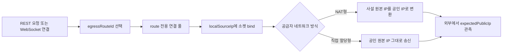

# 공급자 중립 송신 경로 설계

## 목적

CEX SDK는 AWS Elastic IP, Vultr 추가 IPv4 같은 클라우드 상품을 직접 제어하지 않습니다. SDK의 네트워크 계약은 하나입니다.

> 논리적인 `egressRouteId`를 호스트 OS에 할당된 하나의 `localSourceIp`에 연결하고, 그 주소에 소켓을 bind한다.

클라우드가 주소를 어떻게 할당하거나 NAT하는지는 인프라 계층의 책임입니다. SDK는 시작 시 로컬 주소 존재 여부를 확인하고, 별도 진단 요청으로 거래소가 보게 될 공인 IP를 검증합니다.

## 핵심 모델

| 필드 | 의미 | 필수 여부 |
|---|---|---|
| `id` / `EgressRoute.ID` | 요청과 WebSocket 세션이 선택하는 논리 경로 | 필수 |
| `localSourceIp` / `LocalSourceIP` | OS 네트워크 인터페이스에 실제 할당되어 소켓 bind에 쓰이는 IPv4 | 필수 |
| `expectedPublicIp` / `ExpectedPublicIP` | 외부 서비스와 거래소가 관측해야 하는 공인 IPv4 | 운영 검증 시 필수 |

`localSourceIp`는 이름 그대로 송신 원본 주소이며 사설 IP로 제한하지 않습니다. 현재 전송 계층은 IPv4만 지원합니다.



## 지원 토폴로지

### NAT형: AWS secondary private IPv4와 EIP

AWS에서는 ENI에 secondary private IPv4를 할당하고 각 private IPv4에 EIP를 연결할 수 있습니다. 이 경우 EIP는 게스트 OS의 로컬 주소가 아니므로 `LocalSourceIP`에는 secondary private IPv4를 넣습니다.

```text
EC2 ENI
├── 10.0.10.21  ── NAT ──> 203.0.113.10
└── 10.0.10.22  ── NAT ──> 203.0.113.11
```

```go
route := transport.EgressRoute{
	ID:               "aws-a",
	LocalSourceIP:    net.ParseIP("10.0.10.21"),
	ExpectedPublicIP: net.ParseIP("203.0.113.10"),
}
```

### 직접 할당형: Vultr 추가 public IPv4

Vultr Cloud Compute는 한 인스턴스에 추가 public IPv4를 할당할 수 있습니다. 해당 주소가 게스트 OS에 직접 보이면 `LocalSourceIP`와 `ExpectedPublicIP`에 같은 값을 넣습니다.

```text
Vultr 인스턴스
├── 203.0.113.20  ──> 203.0.113.20
└── 203.0.113.21  ──> 203.0.113.21
```

```go
route := transport.EgressRoute{
	ID:               "vultr-a",
	LocalSourceIP:    net.ParseIP("203.0.113.20"),
	ExpectedPublicIP: net.ParseIP("203.0.113.20"),
}
```

Vultr 제어판이나 API에서 IP를 추가한 것만으로 운영 준비가 끝났다고 가정하지 않습니다. 재부팅 또는 OS 네트워크 설정 적용 뒤 `ip -4 addr`에서 주소가 보이는지, 해당 주소를 원본으로 지정한 외부 연결이 성공하는지 반드시 진단합니다. Reserved IP를 사용할 때도 실제 게스트 라우팅 방식에 맞춰 `LocalSourceIP`를 결정합니다.

### 그 밖의 공급자와 자체 서버

다른 클라우드, 베어메탈, 온프레미스도 다음 조건을 만족하면 같은 방식으로 동작합니다.

1. 선택할 IPv4가 프로세스의 네트워크 네임스페이스에 할당되어 있다.
2. 해당 IPv4를 원본으로 한 기본 또는 정책 라우팅이 구성되어 있다.
3. 외부에서 관측되는 공인 IP를 미리 알 수 있다.
4. 방화벽과 거래소 API Key IP 허용 목록이 그 공인 IP를 허용한다.

## 시작 및 readiness 검증

`transport.NewRegistry`는 모든 `LocalSourceIP`가 현재 호스트에 할당되어 있는지 검사합니다. 하나라도 없으면 서버 시작을 실패시키는 것이 기본 동작입니다.

그 다음 `egressdiag` 또는 `Registry.VerifyPublicIP`로 다음 계약을 확인합니다.

```bash
go run ./cmd/egressdiag \
  -route aws-a,10.0.10.21,203.0.113.10 \
  -route vultr-a,203.0.113.20,203.0.113.20
```

각 `-route` 값의 순서는 `route-id,local-source-ip,expected-public-ip`입니다. 기본 외부 확인 서비스는 `https://api.ipify.org`이며, 운영 환경에서는 독립적으로 관리하는 확인 endpoint를 함께 사용할 수 있습니다.

readiness는 최소한 다음 조건을 모두 만족해야 합니다.

1. `localSourceIp`가 로컬 인터페이스에 존재한다.
2. route 전용 연결로 외부 확인 endpoint를 호출할 수 있다.
3. 관측된 공인 IP가 `expectedPublicIp`와 같다.
4. API Key의 허용 route 목록과 거래소에 등록한 공인 IP 목록이 일치한다.

## 연결 풀과 WebSocket 규칙

- 각 route는 별도의 `net.Dialer`와 `http.Transport`를 사용합니다.
- 하나의 route 안에서는 origin별 keep-alive 연결을 재사용하지만 서로 다른 route끼리는 소켓을 공유하지 않습니다.
- 환경변수 기반 HTTP proxy는 기본 전송에서 비활성화합니다. proxy를 사용하면 외부 관측 IP가 route 계약과 달라질 수 있습니다.
- WebSocket은 최초 연결과 모든 자동 재연결을 생성 시 선택한 route에 고정합니다.
- 이미 열린 TCP 또는 WebSocket 연결의 source IP는 중간에 바꾸지 않습니다. route 변경은 기존 세션을 닫고 새 세션을 만드는 작업입니다.

## 실행 중 IP 추가 할당

현재 `transport.Registry`의 route 집합은 생성 시 고정됩니다. Vultr API나 IaC로 실행 중 IP를 추가할 때는 다음 순서를 사용합니다.

1. 인프라 제어 계층이 새 IP를 생성하고 인스턴스에 연결한다.
2. 게스트 OS가 주소와 필요한 정책 라우팅을 적용할 때까지 기다린다.
3. 새 `localSourceIp`에서 외부 확인 요청을 보내 `expectedPublicIp`를 검증한다.
4. 새 route가 포함된 설정으로 프로세스를 재시작하거나 새 Registry로 트래픽을 drain한다.
5. API Key 허용 IP 목록 반영이 끝난 뒤 private 요청을 활성화한다.

이 순서에서 공급자 API 호출과 OS 설정은 SDK 프로세스 밖에서 수행합니다. 향후 무중단 route reload를 추가하더라도 기존 주문 mutation과 WebSocket을 새 IP로 자동 이동시키지 않고 명시적인 drain 계약을 유지합니다.

## 설정 호환성

표준 Go 필드는 `LocalSourceIP`, JSON 필드는 `localSourceIp`입니다. 이전 `LocalPrivateIP`와 `localPrivateIp`는 기존 사용자 마이그레이션을 위해 계속 허용하지만 새 코드에서는 사용하지 않습니다.

두 필드를 동시에 넣으면 같은 IP여야 하며, 값이 다르면 설정 오류로 거부합니다. 진단 및 smoke JSON 증적은 공급자 중립적인 `localSourceIp`만 출력합니다.

## 운영 책임 경계

SDK가 담당하는 범위는 source IP bind, route별 연결 풀 격리, 로컬 주소 검사, 외부 공인 IP 검증입니다. 다음 작업은 인프라 또는 배포 자동화가 담당합니다.

- AWS EIP 할당과 ENI 연결
- Vultr 추가 IPv4 또는 Reserved IP 생성과 인스턴스 연결
- 게스트 OS 주소·정책 라우팅 설정
- 방화벽, 보안 그룹, 네트워크 ACL 설정
- 장애 시 IP 재연결과 애플리케이션 재시작 또는 drain

SDK는 여러 공인 IP를 거래소의 계정·UID 단위 제한이나 이용 정책을 우회하는 수단으로 사용하지 않습니다.

## 공식 참고 문서

- [Vultr Cloud Compute에 추가 IPv4 할당](https://docs.vultr.com/products/compute/instances/cloud-compute/networking/ipv4)
- [Vultr Cloud Compute에 Reserved IP 연결](https://docs.vultr.com/products/compute/instances/cloud-compute/networking/reserved-ips)
- [AWS EC2 인스턴스 IP 주소와 다중 IP](https://docs.aws.amazon.com/AWSEC2/latest/UserGuide/using-instance-addressing.html)
- [AWS EC2 secondary IP 주소 설정](https://docs.aws.amazon.com/AWSEC2/latest/UserGuide/instance-secondary-ip-addresses.html)
- [ipify 공인 IP 확인 API](https://www.ipify.org/)
