# Proven Trade SDK 프로젝트 기획서

- 상태: 구현 진행 중
- 작성일: 2026-08-24
- 대상: 중앙화 거래소 REST/WebSocket SDK 및 AWS 다중 EIP 송신 제어
- 기준 거래소: Binance, Bitget, Upbit
- 구현 언어: Go

## 1. 한 줄 정의

여러 거래소의 공통 거래 기능과 거래소 고유 기능을 타입 안전하게 제공하며, 각 REST 요청과 WebSocket 연결이 사용할 공인 송신 IP를 명시적으로 선택할 수 있는 서버용 SDK를 만든다.

## 2. 배경과 문제

거래소마다 인증, 서명, 심볼, 주문 상태, 정밀도, 에러, 요청 제한 정책이 다르다. 전략 코드가 거래소별 HTTP 규칙과 네트워크 송신 IP까지 직접 관리하면 다음 문제가 생긴다.

- 거래소를 추가할 때 전략 코드가 함께 변경된다.
- 같은 주문 개념이 거래소마다 다르게 해석되어 금액 또는 수량 오류가 생긴다.
- API Key의 IP 허용 목록과 실제 송신 EIP가 어긋날 수 있다.
- HTTP keep-alive 연결이 재사용되면서 요청에 지정한 EIP와 실제 EIP가 달라질 수 있다.
- 거래소별 IP/계정/UID 단위 요청 제한을 하나의 전역 제한기로 처리하기 어렵다.
- 주문 요청 타임아웃 시 재시도로 중복 주문이 생성될 수 있다.

## 3. 목표

### 3.1 제품 목표

1. 공통 API만 익히면 여러 거래소의 시세 조회, 계정 조회, 현물/파생 주문을 사용할 수 있게 한다.
2. 공통 모델이 표현하지 못하는 기능은 거래소 전용 API로 손실 없이 제공한다.
3. 클라이언트 기본 EIP와 요청별 EIP 재정의를 모두 지원한다.
4. 인증 정보별로 허용된 EIP만 사용하게 하여 IP 허용 목록 사고를 사전에 차단한다.
5. 요청 제한, 재시도, 시간 동기화, 관측성, 오류 분류를 SDK 공통 계층에서 처리한다.
6. 새 거래소 어댑터가 기존 거래소 구현을 건드리지 않고 추가되게 한다.

### 3.2 성공 지표

- P0 거래소 공통 기능 적합성 테스트 100% 통과
- 요청별로 선택한 `egressRouteId`와 외부에서 관측한 EIP가 100% 일치
- 주문 생성의 불명확한 결과(타임아웃 등)에 대한 자동 중복 주문 0건
- API Key, Secret, Passphrase, 서명 원문이 로그에 노출되는 사례 0건
- 거래소별 요청 제한 위반으로 인한 예방 가능한 IP 차단 0건
- 신규 거래소의 기본 현물 기능을 코어 변경 없이 어댑터 패키지로 추가 가능

## 4. 비목표

초기 버전에서는 다음을 범위에서 제외한다.

- 거래 전략, 차익거래 엔진, 주문 분할 알고리즘 자체
- OMS, 포트폴리오 회계, PnL 원장, 세금 계산
- 입출금 실행 기능. 조회는 가능하지만 실행 권한은 별도 보안 검토 후 추가한다.
- 거래소 화면의 모든 기능을 억지로 하나의 공통 모델로 추상화하는 것
- 여러 EIP를 이용해 거래소 요청 제한 또는 이용 정책을 우회하는 기능
- 브라우저용 SDK. Secret을 다루므로 서버 런타임만 지원한다.
- 마이크로초 단위 초저지연/FIX 트레이딩

## 5. 지원 범위와 우선순위

“지원”은 HTTP 호출 래퍼가 존재한다는 의미가 아니다. 인증, 정밀도 검증, 요청 제한, 에러 정규화, 테스트, 문서, 네트워크 경로 검증까지 완료되어야 지원 완료로 표시한다.

### 5.1 거래소 단계

| 등급 | 거래소 | 초기 상품 | 비고 |
|---|---|---|---|
| P0 | Binance | Spot, USDⓈ-M Futures | 최초 공통 모델 검증 |
| P0 | Bitget | Spot, USDT-M Futures | Passphrase 및 UID/IP 제한 반영 |
| P0 | Upbit | Spot | KRW 마켓, JWT 인증, IP 허용 목록 반영 |
| P1 | Bybit | Spot, Linear Perpetual | V5 API 기준 |
| P1 | OKX | Spot, Swap | 계정 모드와 지역별 도메인 반영 |
| P1 | Coinbase Advanced | Spot | 포트폴리오/키 범위 반영 |
| P1 | Kraken | Spot, Futures | Spot/Futures API 차이 분리 |
| P1 | Bithumb, Coinone, Korbit | Spot | 국내 거래소 확장 |
| P2 | KuCoin, Gate.io | Spot, Futures | 수요와 운영 계정 확보 후 |

목록은 고정 문자열이 아니라 `exchange-support.yaml`에서 상태와 기능을 관리하고 문서/테스트 표를 생성하도록 설계한다.

### 5.2 기능 단계

| 영역 | v0.1 | v0.2 | 이후 |
|---|---|---|---|
| 공용 시세 REST | 상품, 현재가, 호가, 체결, 캔들 | 전체 P1 확장 | 대용량 이력 수집 최적화 |
| 계정 | 잔고, 주문, 체결 | 포지션, 수수료 | 서브계정 |
| 주문 | 생성, 조회, 취소 | 정정, 일괄 주문 | 고급 주문/조건부 주문 |
| 파생상품 | P0 기본 주문/포지션 | 레버리지, 마진/포지션 모드 | 옵션 |
| WebSocket | P0 시세 및 개인 주문/체결 | P1 확장 | 로컬 오더북 빌더 |
| 자산 이동 | 조회만 | 내부 이체 검토 | 입출금은 별도 승인 |
| 다중 EIP | REST 요청별 선택 | WebSocket 연결별 선택/상태관리 | 장애 조치 정책 확장 |

## 6. 핵심 설계 원칙

### 6.1 공통 API와 Native API를 함께 제공

- `unified`: 여러 거래소에서 의미가 같은 기능만 정규화한다.
- `native`: 거래소 고유 필드와 엔드포인트를 원형에 가깝게 제공한다.
- 공통 모델에 없는 원본 필드는 `raw`에 보존하되, Secret이나 서명 정보는 절대 포함하지 않는다.
- 지원하지 않는 기능은 묵시적으로 무시하지 않고 `UnsupportedCapabilityError`를 반환한다.

### 6.2 숫자는 부동소수점으로 처리하지 않음

- 가격, 수량, 금액, 수수료는 입력/응답에서 decimal 문자열 또는 Decimal 타입을 사용한다.
- 어댑터는 거래소의 tick size, step size, 최소 주문금액을 메타데이터로 제공한다.
- 기본 동작은 잘못된 정밀도를 자동 반올림하지 않고 주문 전에 거절하는 것이다.
- 명시적 quantize 도우미만 `floor`, `ceil`, `nearest` 정책을 받는다.

### 6.3 네트워크 경로도 API 계약의 일부

- `egressRouteId`는 단순 로그 태그가 아니라 실제 소켓의 local private IP를 결정한다.
- 인증 정보는 `allowedEgressRouteIds`를 가져야 한다.
- 존재하지 않거나 OS에 할당되지 않은 private IP는 요청 전 즉시 실패한다.
- 연결 풀은 최소한 `(origin, localPrivateIp, protocol)` 단위로 분리한다.

### 6.4 안전한 실패

- 조회 요청과 주문 요청의 재시도 정책을 분리한다.
- 주문 타임아웃은 단순 실패가 아니라 `UNKNOWN_EXECUTION_STATE`로 분류한다.
- `clientOrderId`로 거래소 상태를 조회해 결과를 조정하기 전에는 주문 생성을 재전송하지 않는다.
- 사용자가 취소하지 않은 주문을 SDK가 임의로 취소하지 않는다.

## 7. 제안 아키텍처

```mermaid
flowchart LR
    A[Strategy / Service] --> B[Unified or Native Client]
    B --> C[Capability and Input Validation]
    C --> D[Credential and Egress Resolver]
    D --> E[Rate Limit Scheduler]
    E --> F[Exchange Serializer and Signer]
    F --> G[Transport Pool Registry]
    G --> H1[Pool: private IP A]
    G --> H2[Pool: private IP B]
    H1 --> I1[EIP A via Internet Gateway]
    H2 --> I2[EIP B via Internet Gateway]
    I1 --> J[Exchange API]
    I2 --> J
    J --> K[Decoder and Error Normalizer]
    K --> L[Metrics / Logs / Traces]
```



중요한 순서는 다음과 같다.

1. 명령과 요청 옵션 검증
2. 계정과 `egressRouteId` 결정 및 허용 관계 검증
3. 거래소/IP/계정/엔드포인트 기준 요청 제한 슬롯 확보
4. 쿼리와 본문을 최종 직렬화
5. 최종 직렬화 결과에 서명
6. 선택한 private IP 전용 연결 풀로 전송
7. 응답 헤더의 요청 제한 상태 갱신
8. 거래소 오류를 공통 오류와 원본 오류로 변환
9. 민감 정보를 제거한 관측 이벤트 기록

서명 이후 쿼리, 본문, 타임스탬프를 변경하면 안 된다.

## 8. Go 패키지 구조 제안

단일 Go module 안에서 코어, 전송 계층, 거래소 어댑터를 패키지로 분리한다. 공통 명세와 언어 중립 테스트 벡터는 향후 다른 언어 구현에서도 재사용할 수 있게 보존한다.

```text
proven-trade-sdk/
├── cmd/
│   └── egressdiag/           # route별 실제 공인 IP 진단 CLI
├── exchange/
│   ├── binance/              # Spot / USD-M 어댑터
│   ├── bitget/               # Spot / USDT-M 어댑터
│   ├── upbit/                # Spot 어댑터
│   └── bybit/                # Spot / Linear 어댑터
├── model/                    # 공통 타입, capability, decimal 규칙
├── transport/                # net.Dialer, http.Transport, timeout, retry
├── stream/                   # route 고정 WebSocket 연결과 재연결
├── credential/               # SecretProvider와 route 허용 정책
├── ratelimit/                # 다차원 rate limiter
├── telemetry/                # 로그, metric, trace 계약
├── conformance/              # 어댑터 적합성 스위트와 signer vectors
├── internal/
│   └── testexchange/         # 장애를 재현하는 mock exchange server
├── examples/
│   ├── market-data/
│   ├── order-lifecycle/
│   └── multi-eip/
├── config/
│   └── exchange-support.yaml
├── docs/
│   ├── PROJECT_PLAN.md
│   ├── api/
│   ├── exchanges/
│   └── runbooks/
└── infra/
    └── aws/                  # 네트워크 구성 예제. 실제 계정 값은 포함하지 않음
```

거래소 구현은 각각 독립된 Go package로 분리한다. 코어가 개별 거래소 package를 역으로 참조하지 않게 하여 import cycle을 방지하고, 사용자가 필요한 어댑터만 import할 수 있게 한다.

### 8.1 Go 구현 원칙

- 외부 I/O가 있는 모든 메서드는 첫 인자로 `context.Context`를 받는다.
- 공개 client와 transport는 동시 호출에 안전해야 하며 전역 mutable state를 두지 않는다.
- 정상적인 운영 오류에 `panic`을 사용하지 않고 `error`를 반환한다.
- 공통 오류는 `errors.Is`/`errors.As`로 분류할 수 있게 구현한다.
- `http.Client`와 `http.Transport`는 요청마다 생성하지 않고 장기 재사용한다.
- SDK가 HTTP 응답 body를 항상 닫고, 스트리밍 API의 소유권은 문서로 명시한다.
- 지원 Go 버전은 릴리스 시점의 최신 안정 버전과 직전 안정 버전을 원칙으로 한다.
- 정밀 금액 타입은 벤치마크와 API 사용성을 비교해 선정하되 `float64` 주문 입력은 허용하지 않는다.

## 9. 외부 API 초안

아래 코드는 방향을 설명하기 위한 Go API 초안이다. 패키지 경로는 module 초기화 시 확정한다.

```go
sdk, err := trade.New(trade.Config{
	Credentials: secretProvider,
	EgressRoutes: []transport.EgressRoute{
		{
			ID:               "seoul-eip-a",
			LocalPrivateIP:   net.ParseIP("10.0.10.21"),
			ExpectedPublicIP: net.ParseIP("203.0.113.10"),
		},
		{
			ID:               "seoul-eip-b",
			LocalPrivateIP:   net.ParseIP("10.0.10.22"),
			ExpectedPublicIP: net.ParseIP("203.0.113.11"),
		},
	},
})
if err != nil {
	return err
}
defer sdk.Close()

upbitClient, err := upbit.New(sdk, trade.ExchangeOptions{
	AccountID:            "upbit-main",
	DefaultEgressRouteID: "seoul-eip-a",
})
if err != nil {
	return err
}

ticker, err := upbitClient.Unified().Market().GetTicker(
	ctx,
	market.GetTickerRequest{Symbol: "BTC/KRW"},
	trade.WithEgressRoute("seoul-eip-b"),
	trade.WithTimeout(3*time.Second),
)
if err != nil {
	return err
}

createdOrder, err := upbitClient.Unified().Orders().Create(
	ctx,
	order.CreateRequest{
		Symbol:        "BTC/KRW",
		Side:          order.SideBuy,
		Type:          order.TypeLimit,
		Quantity:      "0.001",
		Price:         "100000000",
		ClientOrderID: "strategy-a-20260824-000001",
	},
	trade.WithEgressRoute("seoul-eip-a"),
)
if err != nil {
	return err
}

log.Printf("ticker=%s orderID=%s", ticker.Price, createdOrder.ID)
```

### 9.1 Egress 선택 규칙

우선순위는 다음과 같다.

1. 요청 옵션의 `egressRouteId`
2. 거래소 클라이언트의 `defaultEgressRouteId`
3. 계정 정책에 설정된 기본 route
4. 어느 것도 없으면 `MissingEgressRouteError`

운영 환경에서 자동 임의 선택은 기본으로 허용하지 않는다. 추후 `sticky`, `roundRobin`, `leastLoaded`, `failover` 정책을 추가하더라도 인증 정보의 허용 목록 안에서만 선택한다.

### 9.2 Credentials 계약

```go
type CredentialDescriptor struct {
	AccountID             string
	Exchange              model.ExchangeID
	SecretRef             string
	Permissions           []credential.Permission
	AllowedEgressRouteIDs []transport.EgressRouteID
}
```

- Secret은 SDK 설정 객체, 로그, 오류 객체에 평문으로 남기지 않는다.
- AWS Secrets Manager, Vault, 환경 변수 등을 어댑트할 `SecretProvider` 인터페이스를 둔다.
- 캐시 시간과 갱신 실패 정책을 명시한다.
- 출금 권한이 있는 키는 초기 버전에서 거부하거나 별도 opt-in을 요구한다.

## 10. AWS 다중 EIP 설계

### 10.1 권장 구성

한 개의 primary ENI에 여러 secondary private IPv4를 할당하고, 각 private IPv4에 EIP를 하나씩 연결한다.

```text
EC2 eth0 / ENI
├── 10.0.10.20 (primary private IP)
├── 10.0.10.21 (secondary) <-> EIP A
├── 10.0.10.22 (secondary) <-> EIP B
└── 10.0.10.23 (secondary) <-> EIP C
```

SDK는 `10.0.10.21` 같은 private IP에 소켓을 bind한다. EIP는 EC2 운영체제의 로컬 주소가 아니므로 EIP에 직접 bind하지 않는다. 인터넷 게이트웨이가 private IP와 연결된 EIP 사이에서 1:1 변환한다.

### 10.2 배포 조건

- ENI가 있는 서브넷의 기본 경로가 Internet Gateway로 향해야 한다.
- 인스턴스 타입별 ENI당 private IP 한도를 배포 전에 확인한다.
- 운영체제가 secondary private IPv4를 로컬 주소로 인식하는지 부팅 시 검증한다.
- 인바운드는 Security Group으로 차단하고 운영 접속은 SSM을 우선한다.
- IMDSv2를 강제하고 EC2 권한은 네트워크 조회에 필요한 최소 권한만 부여한다.
- 여러 ENI를 같은 서브넷에 붙이면 비대칭 라우팅 위험이 있으므로 1차 버전은 단일 ENI를 사용한다.
- EIP/secondary IP 연결 정보는 IaC 상태와 애플리케이션 설정에서 동일한 논리 ID로 관리한다.

### 10.3 시작 시 검증

SDK 또는 별도 readiness check가 다음을 확인한다.

1. 설정된 `localPrivateIp`가 실제 네트워크 인터페이스에 존재한다.
2. route별 진단 요청이 성공한다.
3. 외부 echo 서비스에서 본 공인 IP가 `expectedPublicIp`와 일치한다.
4. 계정에 필요한 route가 모두 healthy 상태다.

거래 주문 경로에서 매번 공인 IP 확인 API를 호출하지 않는다. 부팅, 주기 진단, 설정 변경 시에만 확인한다.

### 10.4 HTTP 연결 풀

- local private IP별로 별도 `net.Dialer`와 `http.Transport`를 둔다.
- `net.Dialer.LocalAddr`에는 `&net.TCPAddr{IP: route.LocalPrivateIP}`를 설정하고 그 `DialContext`를 `http.Transport`에 연결한다.
- 하나의 `http.Transport`는 내부적으로 origin별 연결 풀을 관리하므로, route/TLS 설정이 같을 때 해당 transport를 장기 재사용한다.
- 기본 transport에서는 환경 변수 기반 HTTP proxy를 비활성화한다. proxy를 통하면 거래소가 보는 송신 IP가 EIP가 아닌 proxy IP가 되기 때문이다.
- 요청이 끝난 뒤에도 해당 풀의 소켓은 동일 route에서만 재사용한다.
- DNS 결과, TLS SNI와 인증서 검증은 일반 HTTPS 규칙을 그대로 따른다.
- registry는 `localPrivateIp`, protocol, TLS 설정별 transport를 분리하고, 각 transport가 origin별 실제 연결 풀을 관리한다.
- route가 unhealthy가 되면 신규 요청을 차단하고 기존 유휴 연결을 폐기한다.
- failover는 조회 요청에만 자동 적용한다. 주문 요청은 명시적 조정 절차 없이는 다른 route로 자동 재전송하지 않는다.

### 10.5 WebSocket

- WebSocket도 최초 TCP 연결 시 local private IP를 선택한다.
- Go WebSocket 구현에는 route 전용 `net.Dialer.DialContext`를 주입한다.
- 이미 연결된 WebSocket의 EIP는 중간에 바꿀 수 없다.
- 최소 `(exchange, account, channel class, egressRouteId)`별로 연결을 분리한다.
- 재연결 시 같은 route를 유지하고, 변경은 명시적인 drain/reconnect 작업으로 처리한다.
- sequence gap이 발견되면 REST snapshot 또는 거래소별 복구 절차로 재동기화한다.

## 11. 요청 제한 설계

고정된 `requestsPerSecond` 하나로 모든 거래소를 처리하지 않는다. 엔드포인트 메타데이터와 응답 헤더를 이용하는 다차원 limiter를 둔다.

키의 예시는 다음과 같다.

```text
(exchange, egressRouteId, rateLimitGroup)
(exchange, accountId, rateLimitGroup)
(exchange, accountId, symbol, orderLimitGroup)
```

- Binance: IP request weight와 계정 order count를 별도로 추적
- Bitget: IP, UID, 엔드포인트별 제한을 메타데이터로 표현
- Upbit: 공개 시세의 IP 기준과 private 요청의 계정/정책 단위를 분리하고 응답의 잔여 요청 정보를 반영
- `429` 또는 거래소 고유 제한 오류는 `Retry-After`와 응답 헤더를 우선해 backoff
- 제한값은 코드 상수만 믿지 않고 버전 관리되는 메타데이터로 관리
- EIP가 여러 개여도 거래소 정책상 계정 단위 제한을 IP별로 중복 사용하지 않음

## 12. 재시도와 주문 안전성

| 상황 | 기본 처리 |
|---|---|
| DNS/TCP/TLS 실패, 요청 전송 전 확인 가능 | 멱등 조회만 제한적 재시도 |
| GET/조회 429 | 서버 힌트 기반 대기 후 제한적 재시도 |
| GET 5xx | jitter를 포함한 exponential backoff |
| 주문 생성 4xx | 재시도하지 않고 정규화된 오류 반환 |
| 주문 생성 후 응답 전 timeout/connection reset | `UNKNOWN_EXECUTION_STATE`, clientOrderId로 조회 |
| 취소 요청의 불명확한 결과 | 주문 조회로 최종 상태 조정 |
| 인증/서명/시간 오류 | clock sync 후 안전한 요청만 한 번 재시도 |

모든 mutation에 가능한 경우 SDK가 충돌 가능성이 낮은 `clientOrderId` 생성을 지원한다. 사용자가 직접 제공한 ID는 그대로 보존한다.

## 13. 시간 동기화

- 시스템 NTP/chrony 정상 상태를 배포 전제조건으로 둔다.
- 거래소 server time과 로컬 시간의 offset을 거래소별로 측정한다.
- 왕복 시간의 중간값을 이용해 offset을 추정하고 오래된 측정치는 폐기한다.
- 허용 timestamp window를 거래소별 메타데이터로 관리한다.
- clock drift가 임계값을 넘으면 private mutation을 fail-closed 처리한다.

## 14. 오류 모델

```go
type ErrorCategory string

const (
	ErrorAuthentication        ErrorCategory = "AUTHENTICATION"
	ErrorAuthorization         ErrorCategory = "AUTHORIZATION"
	ErrorValidation            ErrorCategory = "VALIDATION"
	ErrorInsufficientBalance   ErrorCategory = "INSUFFICIENT_BALANCE"
	ErrorOrderNotFound         ErrorCategory = "ORDER_NOT_FOUND"
	ErrorRateLimited           ErrorCategory = "RATE_LIMITED"
	ErrorNetwork               ErrorCategory = "NETWORK"
	ErrorTimeout               ErrorCategory = "TIMEOUT"
	ErrorUnknownExecutionState ErrorCategory = "UNKNOWN_EXECUTION_STATE"
	ErrorExchangeUnavailable   ErrorCategory = "EXCHANGE_UNAVAILABLE"
	ErrorUnsupportedCapability ErrorCategory = "UNSUPPORTED_CAPABILITY"
	ErrorInternal              ErrorCategory = "INTERNAL"
)
```

공통 오류에는 `category`, `exchange`, `accountId`, `requestId`, `retryable`, `httpStatus`, `exchangeCode`, `exchangeMessage`, `cause`를 둔다. 요청 서명, Secret, 전체 Authorization 헤더는 포함하지 않는다.

## 15. 관측성과 운영

### 15.1 구조화 로그

- exchange, market type, endpoint ID, account alias
- `egressRouteId`, local private IP, 기대 EIP
- request ID, exchange request ID, latency, status, retry count
- limiter 대기 시간과 관측된 quota
- 주문은 clientOrderId/orderId만 기록하고 필요 이상의 본문은 남기지 않음

### 15.2 메트릭

- 요청 수/지연시간/오류율: 거래소, endpoint, route별
- 429/418/거래소 제한 오류 수
- limiter queue depth와 wait time
- route health 및 외부 EIP 검증 결과
- WebSocket 연결, 재연결, sequence gap 수
- `UNKNOWN_EXECUTION_STATE` 발생 및 조정 결과

### 15.3 Runbook

- EIP 불일치
- 거래소 IP 차단/429 급증
- API Key 허용 IP 오류
- clock drift
- WebSocket 반복 재연결/데이터 gap
- 주문 결과 불명확 상태 조정
- 거래소 API 버전 폐기 및 긴급 endpoint 변경

## 16. 보안 기준

- API Key는 최소 권한 원칙을 적용하고 read/trade 키를 가능하면 분리한다.
- Secret 저장소 접근 권한과 거래 SDK 실행 권한을 분리한다.
- 로그 redaction을 문자열 치환이 아니라 필드 allowlist 방식으로 구현한다.
- Secret은 오류, trace attribute, metric label, 테스트 fixture에 포함하지 않는다.
- dependency lockfile, 서명된 릴리스, 변경 이력, SBOM 생성을 릴리스 조건으로 둔다.
- production/testnet 자격 증명과 endpoint를 타입 또는 환경 설정으로 분리한다.
- 거래소별 국가/지역 및 API 약관을 준수하고 허용되지 않은 도메인 우회를 지원하지 않는다.

## 17. 테스트 전략

### 17.1 단위 테스트

- 공식 예제를 기반으로 한 signer golden vector
- query/body canonicalization
- decimal 및 정밀도 검증
- 심볼/주문 상태/오류 매핑
- limiter key와 weight 계산
- credential-route 허용 관계

### 17.2 어댑터 적합성 테스트

모든 어댑터가 공통 테스트 스위트를 통과해야 한다.

- 상품 조회 및 normalized symbol
- ticker/order book/candle
- 잔고와 주문 lifecycle
- clientOrderId 보존
- 공통 오류와 원본 오류 보존
- 지원하지 않는 capability의 명시적 실패

### 17.3 통합 테스트

- mock exchange server로 timeout, reset, 429, 5xx, 잘못된 JSON 재현
- testnet/sandbox가 제공되는 거래소는 주문 lifecycle 검증
- sandbox가 없는 경우 production read-only smoke와 명시적 opt-in 소액 주문 테스트 분리
- 각 private IP에서 외부로 나간 실제 EIP 검증
- 서로 다른 route의 동시 요청에서 연결 풀 혼선 여부 검증
- 프로세스 재시작, DNS 변경, route 장애, clock skew 시험

## 18. 완료 조건

각 거래소/상품 조합은 다음을 모두 만족해야 `supported`로 표시한다.

- 공식 문서 버전과 endpoint 목록 기록
- 인증 및 signer golden test 통과
- capability matrix 작성
- 공통 적합성 테스트 통과
- 요청 제한 메타데이터와 429 처리 검증
- 에러 매핑 및 raw error 보존 검증
- 요청/응답 fixture에서 민감 정보 제거
- README 사용 예제와 운영 주의사항 작성
- 실제 계정 read-only smoke 통과
- 거래 기능은 별도 승인된 계정으로 주문 생성-조회-취소 smoke 통과
- 지정 EIP 검증 통과

## 19. 단계별 실행 계획

### Phase 0 — 계약 확정

- Go module 경로, 지원 Go 버전, 의존성 정책 확정
- P0 거래소의 상품 범위와 필수 endpoint 확정
- unified 모델, capability naming, 오류 계약 확정
- AWS EIP 수, instance type, 배포 OS, Secret 저장소 확정
- 실제 거래 없는 네트워크 PoC로 source IP 선택 검증

### Phase 1 — Core와 Transport

- Go module, formatter, linter, test, benchmark, release 기본 구성
- decimal, symbol, market, order, error 공통 타입
- credential/secret provider
- local private IP별 HTTP pool registry
- route readiness/diagnostics
- retry, timeout, clock, limiter, redaction, telemetry

### Phase 2 — P0 REST

- Binance Spot 및 USDⓈ-M Futures
- Bitget Spot 및 USDT-M Futures
- Upbit Spot
- 공통 적합성 스위트와 각 거래소 native API
- read-only 및 주문 smoke 절차

### Phase 3 — WebSocket과 운영 강화

- 공통 route 고정 연결, reconnect, 재구독 수명주기 구현 완료
- Binance Spot public/private stream 구현 완료
- Bitget v3 UTA public/private stream 구현 완료
- Upbit Spot public/private stream 구현 완료
- 거래소별 sequence gap recovery와 장시간 soak test
- 거래소별 인증, heartbeat, sequence gap recovery
- dashboard/alert/runbook
- 장애 주입 및 장시간 soak test

### Phase 4 — P1 확장

- Bybit V5 Spot·Linear REST 구현 완료
- Bybit V5 Spot·Linear public/private WebSocket 구현 완료
- 지원 매트릭스와 운영 수요 순으로 거래소 추가
- 어댑터 생성 템플릿 및 문서 자동 생성
- deprecated API 감지 및 변경 알림 프로세스

## 20. 확정 사항과 배포 전 결정 사항

다음 항목은 구현 기준으로 확정했다.

1. **언어**: Go로 구현한다.
2. **초기 순서**: 공통 코어와 다중 EIP 계층을 먼저 완성하고 Binance Spot, Bitget, Upbit 순으로 어댑터를 확장한다. 파생상품과 WebSocket은 REST 현물 기반을 검증한 뒤 추가한다.
3. **EIP 선택 정책**: 클라이언트 기본 route와 요청별 재정의를 모두 허용한다. 자격증명의 route 허용 목록 검사는 항상 적용한다.

실제 배포 전에 EC2 OS와 instance type, EIP 개수, IaC 도구, Secret 저장소를 운영 환경에 맞게 결정해야 한다.

## 21. 주요 위험과 대응

| 위험 | 영향 | 대응 |
|---|---|---|
| 공통 모델의 과도한 추상화 | 거래소 고유 기능 손실 | unified/native 이중 표면, capability 명시 |
| EIP와 private IP 혼동 | 잘못된 IP 또는 연결 실패 | route 객체에 둘 다 기록, local IP bind, readiness 검증 |
| keep-alive 풀 공유 | 선택하지 않은 EIP 사용 | local private IP별 풀 완전 분리 |
| 주문 POST 자동 재시도 | 중복 주문 | unknown state + clientOrderId 조정 |
| 제한 정책 변경 | IP 차단 | 응답 헤더 기반 동적 상태, 버전 관리 메타데이터 |
| 거래소 API 폐기 | 갑작스러운 장애 | 공식 changelog 모니터링, adapter 독립 릴리스 |
| 숫자 반올림 | 과다 주문/거절 | decimal 사용, 명시적 quantize |
| Secret 로그 노출 | 계정 탈취 | allowlist 로그, redaction 테스트 |
| 여러 ENI 비대칭 라우팅 | 간헐적 네트워크 장애 | 단일 ENI 우선, 확장 시 policy routing 검증 |

## 22. 공식 기준 문서

기획 시점에 확인한 1차 출처다. 실제 구현 시 endpoint별 문서를 다시 고정하고 테스트 벡터를 갱신한다.

- [AWS EC2 인스턴스 IP 주소와 다중 IP](https://docs.aws.amazon.com/AWSEC2/latest/UserGuide/using-instance-addressing.html)
- [AWS Secondary IP 설정](https://docs.aws.amazon.com/AWSEC2/latest/UserGuide/instance-secondary-ip-addresses.html)
- [AWS Elastic Network Interface](https://docs.aws.amazon.com/AWSEC2/latest/UserGuide/using-eni.html)
- [AWS Network Interface 연결 주의사항](https://docs.aws.amazon.com/AWSEC2/latest/UserGuide/network-interface-attachments.html)
- [Binance Spot REST API](https://developers.binance.com/en/docs/products/spot/rest-api)
- [Binance USDⓈ-M Futures API](https://developers.binance.com/en/docs/products/derivatives-trading-usds-futures/Introduction)
- [Bitget API Quick Start](https://www.bitget.com/api-doc/uta/guide)
- [Upbit API 개요](https://docs.upbit.com/kr/reference/api-overview)
- [Upbit 인증](https://docs.upbit.com/kr/reference/auth)
- [Upbit 요청 수 제한](https://docs.upbit.com/kr/reference/rate-limits)
- [Bybit V5 요청 제한](https://bybit-exchange.github.io/docs/v5/rate-limit)
- [OKX V5 API](https://www.okx.com/docs-v5/en/)
- [Coinbase Advanced Trade API](https://docs.cdp.coinbase.com/api-reference/advanced-trade-api/rest-api/introduction)
- [Kraken API Center](https://docs.kraken.com/api/)

## 23. 첫 번째 구현 산출물

기획 승인 후 첫 PR은 거래소 구현보다 네트워크 위험을 먼저 제거한다.

1. Go module과 core/transport 패키지 골격
2. `EgressRoute`, `CredentialDescriptor`, `RequestOptions` 타입
3. local private IP별 HTTP 연결 풀
4. 두 개 이상의 EIP를 구분하는 진단 CLI
5. 존재하지 않는 IP, 허용되지 않은 route, EIP 불일치 테스트
6. mock exchange를 이용한 retry/timeout/connection reuse 테스트

이 PoC를 통과한 다음 Binance 어댑터부터 적합성 스위트를 붙인다.
